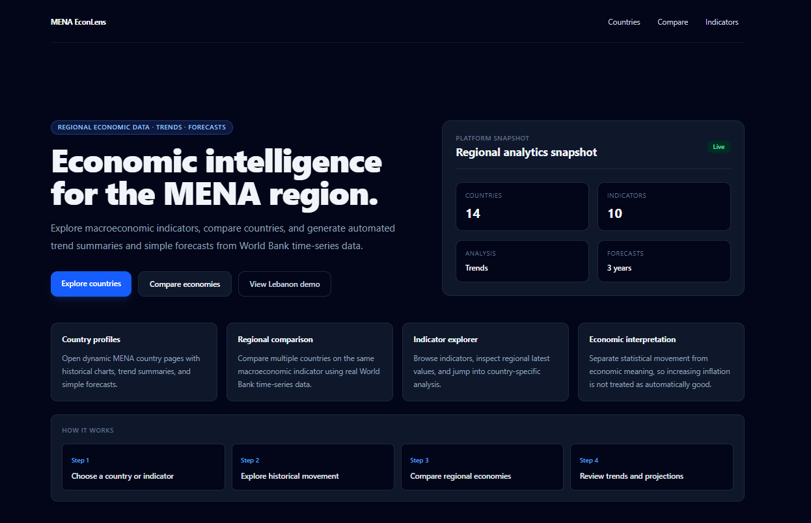
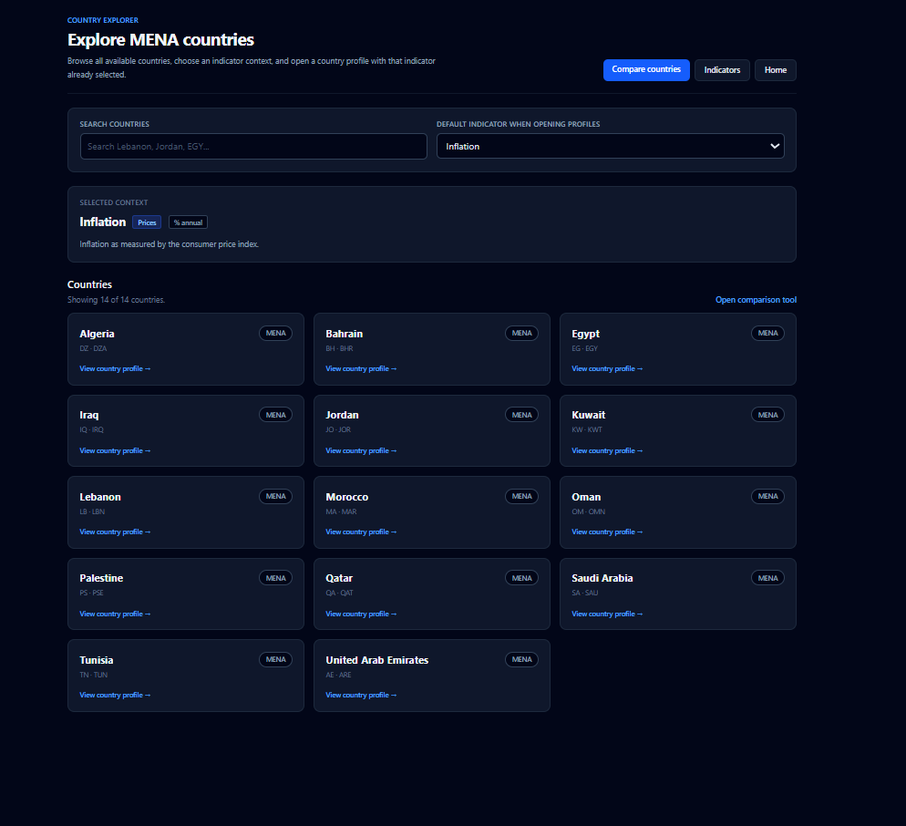
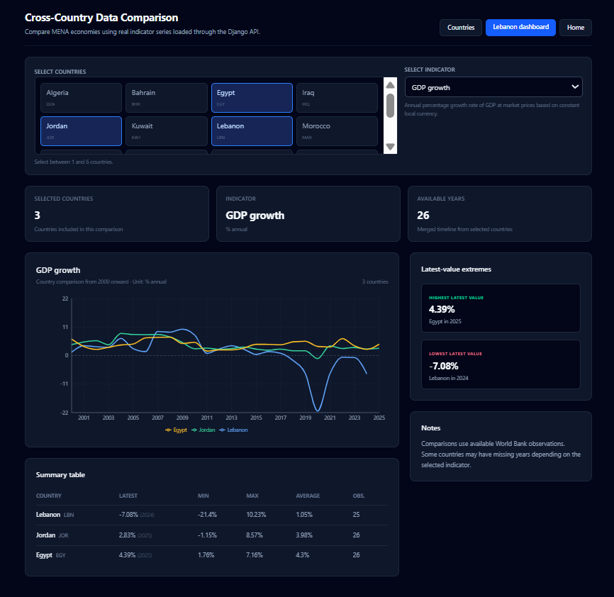
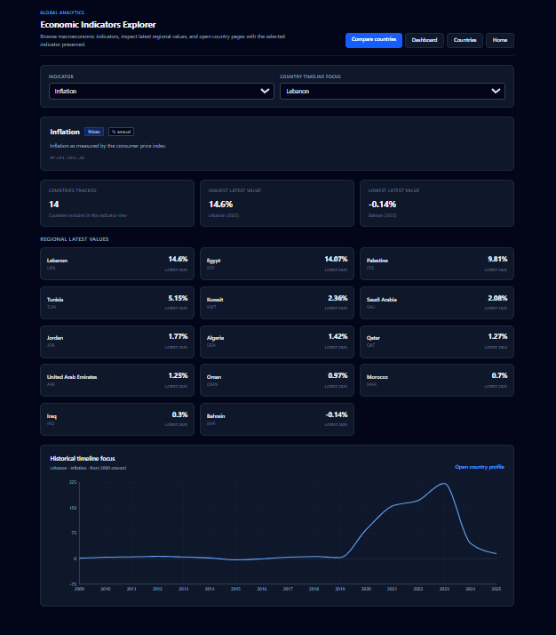
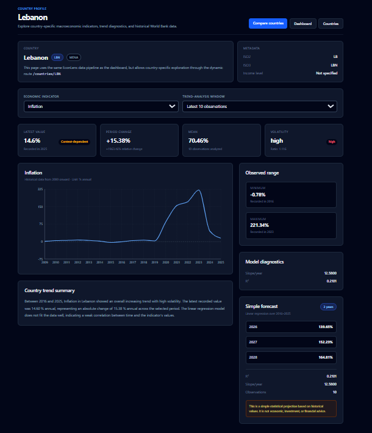

# MENA EconLens

MENA EconLens is a full-stack economic intelligence dashboard for exploring, comparing, and analyzing macroeconomic indicators across MENA countries using World Bank time-series data.

It provides country profiles, regional comparisons, indicator exploration, automated trend summaries, economic interpretation labels, and simple forecasting.

## Features

- Explore MENA country profiles with historical macroeconomic charts
- Compare countries across shared economic indicators
- Browse indicators and latest regional values
- Generate automated trend summaries from historical data
- Classify trends using economic interpretation semantics
- Generate simple linear-regression forecasts
- Preserve selected indicators across navigation using URL query parameters
- Run the full stack locally with Docker and PostgreSQL

## Screenshots

### Landing Page



### Countries Explorer



### Country Comparison



### Indicators Explorer



### Country Detail



## Tech Stack

### Backend

- Python
- Django
- Django REST Framework
- PostgreSQL
- SQLite for non-Docker local development
- Custom Django management commands
- World Bank Indicators API

### Frontend

- React
- TypeScript
- Vite
- Tailwind CSS
- Recharts
- Axios
- React Router

### DevOps

- Docker
- Docker Compose
- PostgreSQL service container

## Core API Endpoints

```text
GET /api/health/
GET /api/countries/
GET /api/countries/{iso3_code}/
GET /api/indicators/
GET /api/indicators/{code}/
GET /api/data/?country=LBN&indicator=FP.CPI.TOTL.ZG
GET /api/compare/countries/?countries=LBN,JOR,EGY&indicator=NY.GDP.MKTP.KD.ZG
GET /api/analysis/trend/?country=LBN&indicator=FP.CPI.TOTL.ZG&window=10
GET /api/analysis/forecast/?country=LBN&indicator=FP.CPI.TOTL.ZG&window=10&years=3
```

## Data Pipeline

1. Seed MENA countries and selected World Bank indicators.
2. Fetch World Bank time-series data using a Django management command.
3. Store observations as country-indicator-year data points.
4. Expose data through REST API endpoints.
5. Analyze time series for trend, volatility, and forecast values.
6. Render dashboards and charts in the React frontend.

## Docker Setup

From the project root:

```bash
docker compose up --build
```

Then open:

```text
http://localhost:5173
```

Backend API health check:

```text
http://localhost:8000/api/health/
```

To fetch World Bank data inside Docker:

```bash
docker compose exec backend python manage.py fetch_worldbank_data
```

To fetch only one country and one indicator:

```bash
docker compose exec backend python manage.py fetch_worldbank_data --country LBN --indicator FP.CPI.TOTL.ZG
```

## Local Backend Setup

```bash
cd backend
python -m venv .venv
.venv\Scripts\activate
pip install -r requirements.txt
python manage.py migrate
python manage.py seed_initial_data
python manage.py fetch_worldbank_data
python manage.py runserver
```

The backend runs on:

```text
http://localhost:8000
```

## Local Frontend Setup

```bash
cd frontend
npm install
npm run dev
```

The frontend runs on:

```text
http://localhost:5173
```

If Vite starts on another port, such as `5174`, either restart it on `5173` or add that origin to the Django CORS configuration.

## Analysis Methodology

The trend analysis service calculates direction of movement, volatility, descriptive statistics, linear slope, and model fit.

Economic interpretation separates statistical movement from economic meaning. For example, increasing GDP growth is usually favorable, while increasing inflation is usually unfavorable.

The forecast endpoint uses a simple linear-regression projection over the selected historical window. It is intended as a lightweight statistical feature, not as economic, investment, or financial advice.

## Main Pages

```text
/                                  Landing page
/countries                         Countries explorer
/countries/LBN                     Country profile
/countries/LBN?indicator=FP.CPI.TOTL.ZG
/dashboard                         Lebanon dashboard demo
/compare                           Country comparison
/indicators                        Indicator explorer
```
